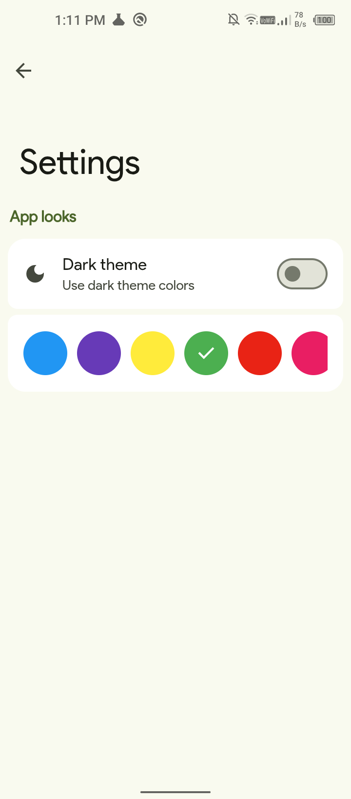

   

<h1 align="center">
 NotesMaster
</h1>
   

      
      
      
      

 

 

# 📝 Features:

- **🏷 Labels** – Organize notes with customizable labels for easy categorization.
- **🔍 Search** – Quickly find notes.
- **🎨 Material Themes** – Choose from beautiful material-designed themes to personalize your experience.
- **📂 Export & Import** – Backup and restore notes with seamless export and import options.
- **📋 View Options** – Switch between list view and grid view for better note browsing.
- **🌍 Formatting** – Bold, italic, underline, strikethrough, number list, bullet list, headings, divider, links, quote, text color, highlighter.
   

# 👁️ Screenshots

 
 

> [!NOTE]
> The app is designed to run on Android devices and does not support web browsers. Attempting to open the app in a browser will not work.
 

# Contact
For any questions or feedback, feel free to open an issue on GitHub or contact pranshul.devmain@gmail.com

 

# License
This project is licensed under the GPL-3.0 license. See the `LICENSE` file for details.
